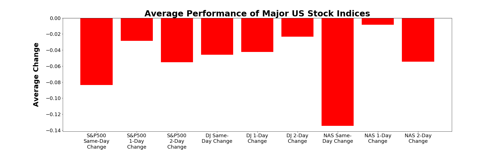
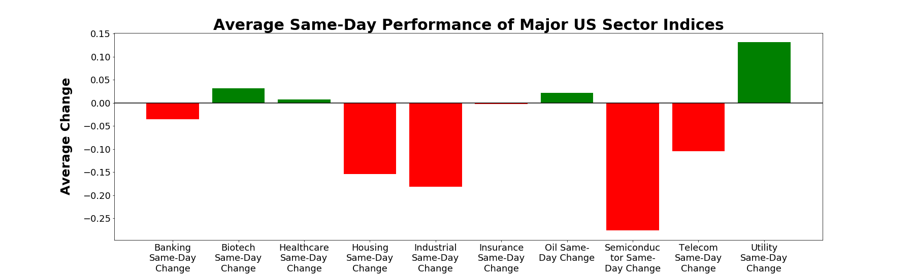
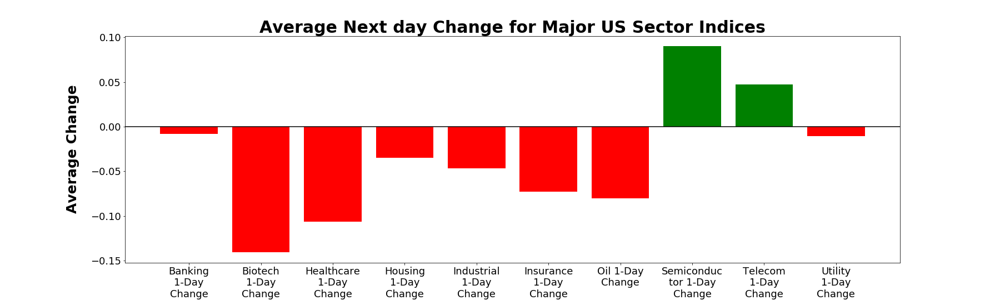
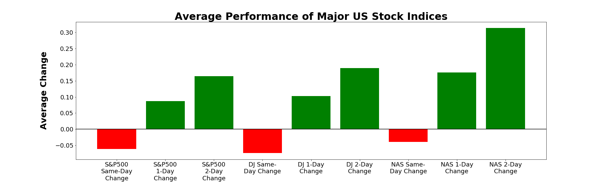
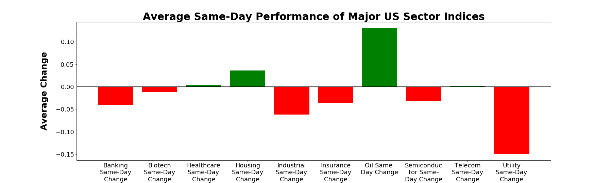
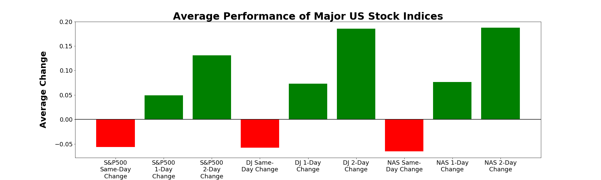
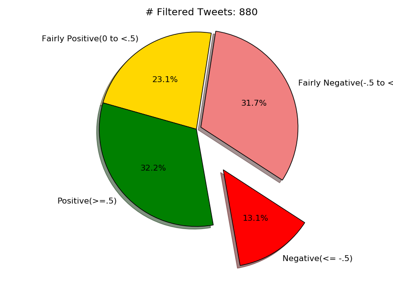

# Project - Social Media Influence on Stock Markets
UCB Bootcamp Group Project 1

Team Members: Rashim, Karthik, Isaac and Ervin

Project Description:
Analysis of the impact of Trump’s tweets on financial markets. 

Research questions to answer: 
1.	What are the sentiments of Trump’s tweets regarding certain key terms?
2.	Do these sentiments have any impact on stock markets?
3.	If present, how long do these impacts last? 
4.	Which sectors are most impacted by these tweets? 
5.	Is impact dependent on number of likes or retweets? 

Data sets used: 
1.	Twitter API
2.	Yahoo Finance CSVs
3.	Alpha Vantage API

